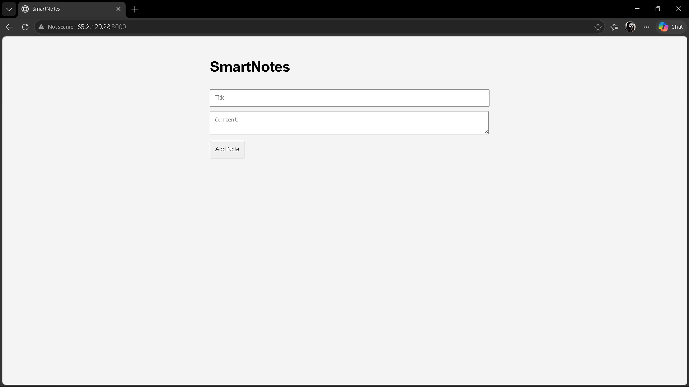
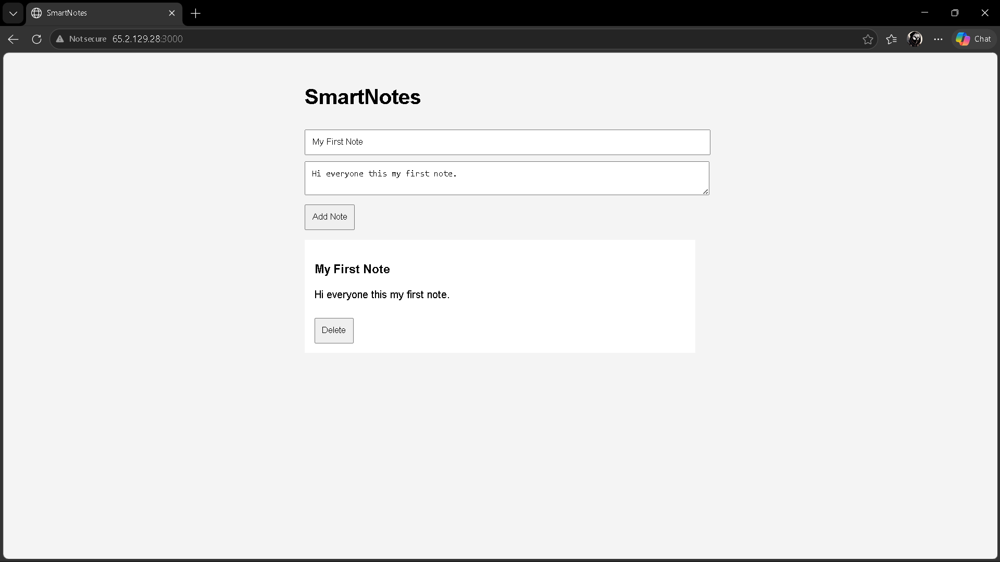
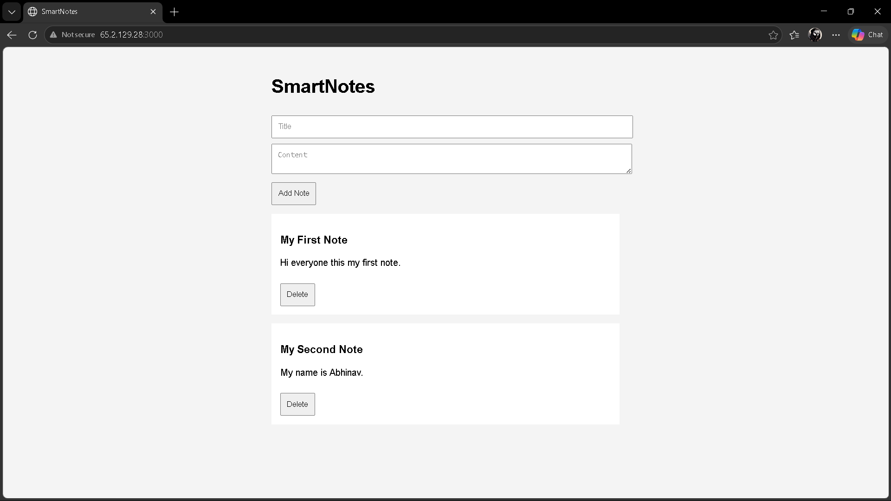
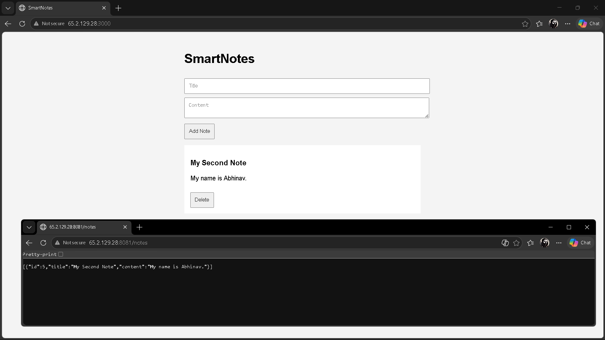
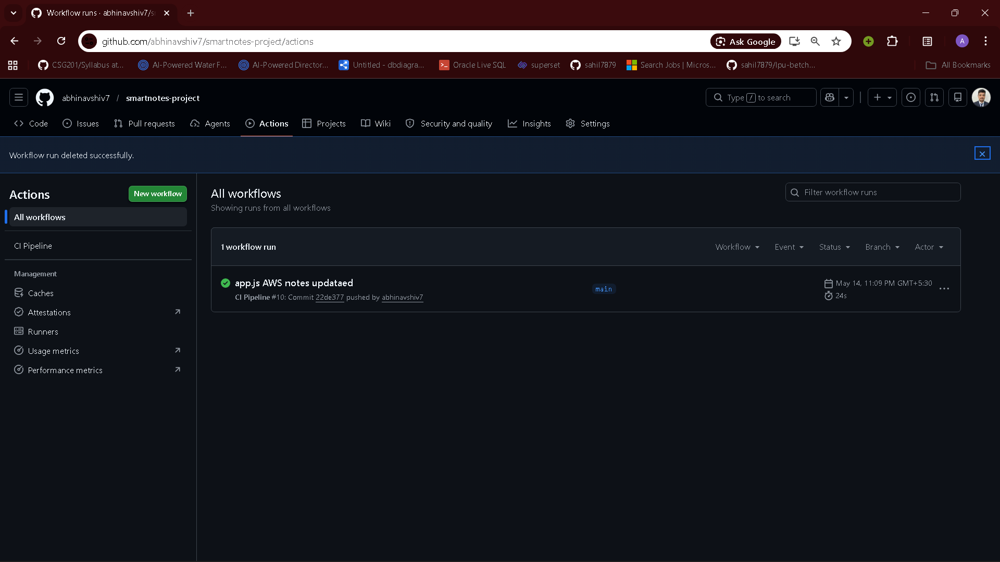
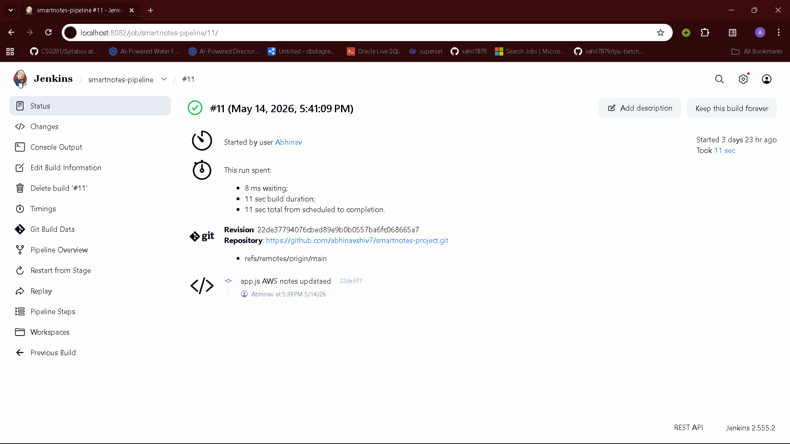
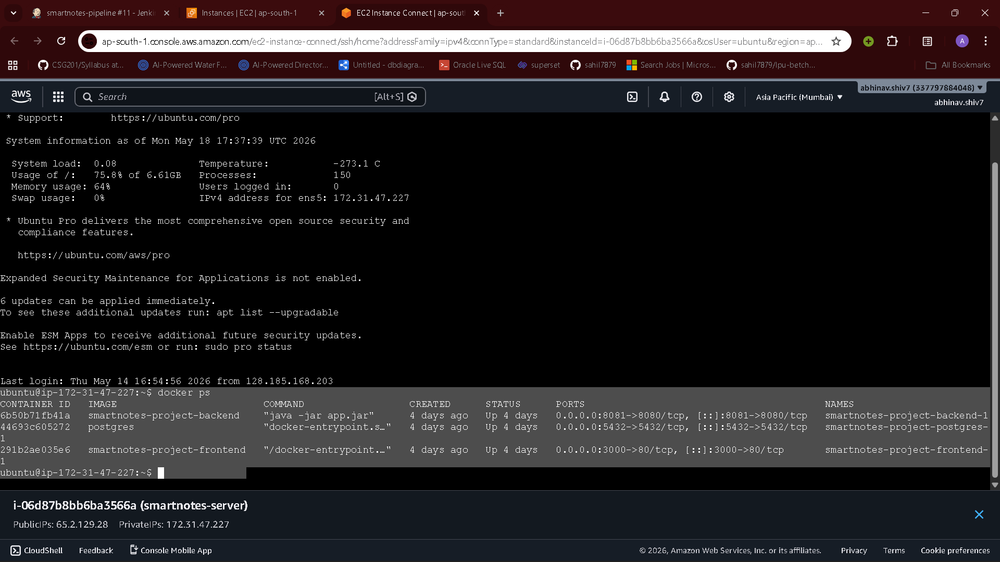

<div align="center">

<h1>📝 SmartNotes</h1>

<p><strong>A full-stack note-taking application built and deployed with a complete DevOps pipeline</strong></p>

<p>
  <a href="http://65.2.129.28:3000" target="_blank">
    
  </a>
  
  
  
  
  
</p>

<p>
  <a href="https://github.com/lakshitchoudhary20/smartnotes/actions">
    
  </a>
  
  
</p>

</div>

---

## 🚀 Live Application

> **The application is deployed on AWS EC2 and accessible at:**
>
> ### 🌐 [http://65.2.129.28:3000](http://65.2.129.28:3000)
>
> | Service  | URL |
> |----------|-----|
> | Frontend | [http://65.2.129.28:3000](http://65.2.129.28:3000) |
> | Backend API | [http://65.2.129.28:8081/notes](http://65.2.129.28:8081/notes) |

---

## 📸 Screenshots

> **📌 Screenshots are placed in the `/screenshots` folder. Capture and add them as described below.**

### Application UI — Home Page

> *The SmartNotes main interface with input fields for Title and Content, and the notes list below.*

### Adding a New Note

> *Filling in the title and content fields and clicking "Add Note".*

### Notes List — After Adding Notes

> *Multiple notes displayed on the page fetched from the PostgreSQL database via the Spring Boot API.*

### Backend REST API — `/notes` Endpoint

> *Raw JSON response from `http://65.2.129.28:8081/notes` showing all stored notes.*

### GitHub Actions CI Pipeline — Build Success

> *GitHub Actions workflow triggered on push to `main` — builds the Spring Boot backend using Maven.*

### Jenkins CD Pipeline — Deployment to AWS EC2

> *Jenkins pipeline with Checkout and Deploy stages, showing successful deployment to the EC2 instance.*

### Docker Containers Running on EC2

> *Output of `docker ps` on the EC2 instance, showing frontend, backend, and postgres containers running.*

---

## 🏗️ Architecture Overview

```
┌─────────────────────────────────────────────────────────────────┐
│                        Developer (Local)                         │
│                     git push → main branch                       │
└────────────────────────────┬────────────────────────────────────┘
                             │
              ┌──────────────▼──────────────┐
              │       GitHub Repository      │
              │  github.com/abhinavshiv7/    │
              │    smartnotes-project        │
              └──────┬───────────┬──────────┘
                     │           │
          ┌──────────▼──┐   ┌───▼────────────┐
          │ GitHub Actions│   │    Jenkins      │
          │  CI Pipeline  │   │  CD Pipeline   │
          │ (Build & Test)│   │ (SSH → EC2)    │
          └──────────────┘   └───────┬────────┘
                                     │  SSH Deploy
                          ┌──────────▼──────────────┐
                          │       AWS EC2 Instance   │
                          │      (Ubuntu, t2.micro)  │
                          │                          │
                          │  ┌────────────────────┐  │
                          │  │  Docker Compose     │  │
                          │  │                     │  │
                          │  │  ┌───────────────┐  │  │
                          │  │  │   Frontend     │  │  │
                          │  │  │  (Nginx:80)    │  │  │
                          │  │  │  Port: 3000    │  │  │
                          │  │  └───────────────┘  │  │
                          │  │  ┌───────────────┐  │  │
                          │  │  │   Backend      │  │  │
                          │  │  │ (Spring Boot)  │  │  │
                          │  │  │  Port: 8081    │  │  │
                          │  │  └───────────────┘  │  │
                          │  │  ┌───────────────┐  │  │
                          │  │  │  PostgreSQL    │  │  │
                          │  │  │  Port: 5432    │  │  │
                          │  │  └───────────────┘  │  │
                          │  └────────────────────┘  │
                          └──────────────────────────┘
```

---

## 🛠️ Tech Stack

| Layer | Technology | Purpose |
|-------|------------|---------|
| **Frontend** | HTML, CSS, Vanilla JS | Note-taking UI served via Nginx |
| **Backend** | Spring Boot 3.x (Java 17) | REST API (`/notes`) |
| **Database** | PostgreSQL | Persistent note storage |
| **Containerization** | Docker & Docker Compose | Multi-service orchestration |
| **CI Pipeline** | GitHub Actions | Build & test on every push to `main` |
| **CD Pipeline** | Jenkins | Automated SSH deployment to AWS EC2 |
| **Cloud Hosting** | AWS EC2 (Ubuntu) | Production server |
| **Build Tool** | Maven | Java dependency management & packaging |

---

## 📂 Project Structure

```
smartnotes-project/
├── 📁 .github/
│   └── 📁 workflows/
│       └── ci.yml              # GitHub Actions CI pipeline
├── 📁 backend/
│   ├── 📁 src/                 # Spring Boot source code
│   ├── Dockerfile              # Multi-stage Docker build (Maven → JRE)
│   └── pom.xml                 # Maven dependencies
├── 📁 frontend/
│   ├── index.html              # Main UI
│   ├── app.js                  # Fetch API calls to backend
│   ├── style.css               # Styling
│   └── Dockerfile              # Nginx-based static server
├── 📁 screenshots/             # Project screenshots (for README)
├── docker-compose.yml          # Orchestrates frontend + backend + postgres
├── Jenkinsfile                 # Jenkins CD pipeline definition
├── .env.example                # Environment variable template
└── README.md
```

---

## ⚙️ CI/CD Pipeline

### 🔵 GitHub Actions — Continuous Integration

Triggered on every `git push` to the `main` branch:

```
Push to main
    │
    ▼
Checkout Code
    │
    ▼
Setup Java 17 (Temurin)
    │
    ▼
Build Backend: ./mvnw clean package
    │
    ▼
✅ Build Passed
```

**Workflow file**: [`.github/workflows/ci.yml`](.github/workflows/ci.yml)

---

### 🔴 Jenkins — Continuous Deployment

Triggered after CI passes, deploys to AWS EC2 via SSH:

```
Jenkins Pipeline
    │
    ├── Stage 1: Checkout (git checkout scm)
    │
    └── Stage 2: Deploy to AWS EC2
            │
            ├── SSH into EC2 (ubuntu@65.2.129.28)
            ├── git clone / git pull
            ├── docker compose down
            └── docker compose up --build -d
```

**Pipeline file**: [`Jenkinsfile`](Jenkinsfile)

---

## 🏃 Run Locally

### Prerequisites
- Docker Desktop installed
- Git

### Steps

```bash
# 1. Clone the repository
git clone https://github.com/abhinavshiv7/smartnotes-project.git
cd smartnotes-project

# 2. Copy environment variables
cp .env.example .env

# 3. Start all services
docker compose up --build
```

### Access the App Locally

| Service | URL |
|---------|-----|
| Frontend | [http://localhost:3000](http://localhost:3000) |
| Backend API | [http://localhost:8081/notes](http://localhost:8081/notes) |
| PostgreSQL | `localhost:5432` |

### Stop All Services

```bash
docker compose down
```

---

## 🌐 Environment Variables

Create a `.env` file in the root directory (see `.env.example`):

```env
POSTGRES_DB=notesdb
POSTGRES_USER=admin
POSTGRES_PASSWORD=yourpassword
```

---

## 📡 REST API Reference

Base URL: `http://65.2.129.28:8081`

| Method | Endpoint | Description |
|--------|----------|-------------|
| `GET` | `/notes` | Fetch all notes |
| `POST` | `/notes` | Create a new note |
| `DELETE` | `/notes/{id}` | Delete a note by ID |

### Example — Create a Note

```bash
curl -X POST http://65.2.129.28:8081/notes \
  -H "Content-Type: application/json" \
  -d '{"title": "My First Note", "content": "Hello from SmartNotes!"}'
```

### Example — Get All Notes

```bash
curl http://65.2.129.28:8081/notes
```

---

## 👨‍💻 Author

**Abhinav Shiv**
- GitHub: [@abhinavshiv7](https://github.com/abhinavshiv7)

---

## 📄 License

This project is licensed under the [MIT License](LICENSE).

---

<div align="center">
  <sub>Built with ❤️ as part of the INT332 DevOps curriculum</sub>
</div>
